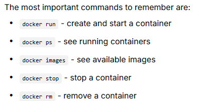
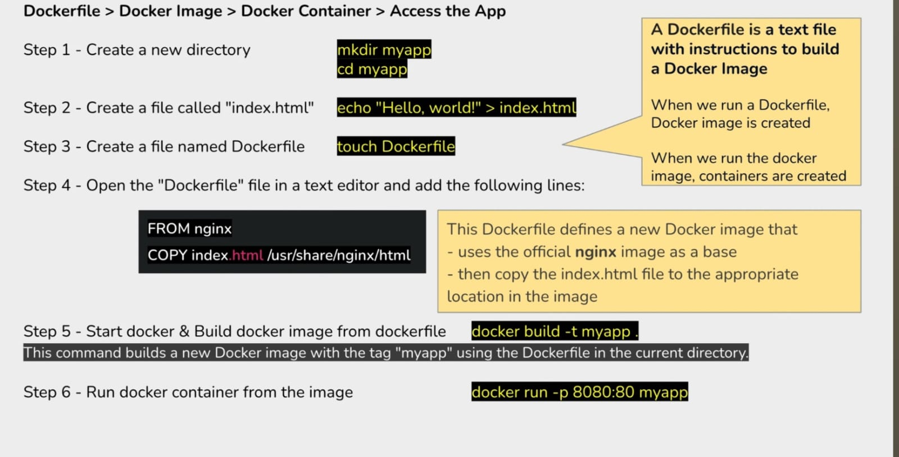

## Topics covered:-
1. Docker
2. Advantages
3. Docker with linux/windows/mac
4. Virtual box and Virtual Machine
5. Docker containers
6. Containers vs VMs
7. Creating VM using BOTO

# What is Docker Architecture?
Think of Docker like a shipping company. Just as a shipping company has different parts working together (trucks, warehouses, tracking systems), Docker has different components that work together to run your applications.
# Main Components of Docker
## 1. Docker Engine (The Heart)
This is the main program that runs on your computerIt's like the engine of a car - it makes everything workIt has three main parts:Docker Daemon: The background service that does the actual workREST API: How other programs talk to DockerDocker CLI: The command-line tool you use to give instructions
## 2. Docker Client (Your Interface)
This is what you use when you type docker commandsIt's like a remote control for your TV - you press buttons, and it tells the TV what to doWhen you type docker run, the client sends this request to the Docker daemon
## 3. Docker Registry (The Store)
This is where Docker images are storedDocker Hub is like an app store for Docker imagesYou can download (pull) images from here or upload (push) your own
# 3. Docker Lifecycle
## Image Lifecycle
- Build: Create an image from a Dockerfile
- Tag: Give the image a name and version
- Push: Upload to a registry (like Docker Hub)
- Pull: Download from a registry
- Remove: Delete the image when not needed
## Container Lifecycle
- Create: Make a container from an image
- Start: Begin running the container
- Stop: Pause the container
- Restart: Stop and start again
- Remove: Delete the container permanently
        
        
# What is a Docker Container?
A Docker container is like actually cooking the meal using the recipe:It's a running instance of an imageIt's the actual application working and doing its jobEach container is isolated from othersYou can have multiple containers from the same image.



## Installation

- sudo apt install docker.io - install docker on linux
- sudo systemctl enable docker - enable docker
- sudo systemctl status docker - checks the status of the docker whether it is running or not




## Code implementation on creating docker container
```
ubuntu@ip-172-31-4-244:~/myapp$ ls
Dockerfile  app  devops-30days  index.html  my  myapp
ubuntu@ip-172-31-4-244:~/myapp$ nano Dockerfile
ubuntu@ip-172-31-4-244:~/myapp$ docker build -t myapp .
DEPRECATED: The legacy builder is deprecated and will be removed in a future release.
            Install the buildx component to build images with BuildKit:
            https://docs.docker.com/go/buildx/

permission denied while trying to connect to the Docker daemon socket at unix:///var/run/docker.sock: Post "http://%2Fvar%2Frun%2Fdocker.sock/v1.47/build?buildargs=%7B%7D&cachefrom=%5B%5D&cgroupparent=&cpuperiod=0&cpuquota=0&cpusetcpus=&cpusetmems=&cpushares=0&dockerfile=Dockerfile&labels=%7B%7D&memory=0&memswap=0&networkmode=default&rm=1&shmsize=0&t=myapp&target=&ulimits=%5B%5D&version=1": dial unix /var/run/docker.sock: connect: permission denied
ubuntu@ip-172-31-4-244:~/myapp$ sudo docker build -t myapp .
DEPRECATED: The legacy builder is deprecated and will be removed in a future release.
            Install the buildx component to build images with BuildKit:
            https://docs.docker.com/go/buildx/

Sending build context to Docker daemon  395.3kB
Error response from daemon: dockerfile parse error on line 2: COPY requires at least two arguments, but only one was provided. Destination could not be determined
ubuntu@ip-172-31-4-244:~/myapp$ vi Dockerfile
ubuntu@ip-172-31-4-244:~/myapp$ rm -i Dockerfile
rm: remove regular file 'Dockerfile'? yes
ubuntu@ip-172-31-4-244:~/myapp$ ls
app  devops-30days  index.html  my  myapp
ubuntu@ip-172-31-4-244:~/myapp$ rm -i app
rm: cannot remove 'app': Is a directory
ubuntu@ip-172-31-4-244:~/myapp$ rm -r app
ubuntu@ip-172-31-4-244:~/myapp$ rm -r my
ubuntu@ip-172-31-4-244:~/myapp$ ls
devops-30days  index.html  myapp
ubuntu@ip-172-31-4-244:~/myapp$ touch Dockerfile
ubuntu@ip-172-31-4-244:~/myapp$ vi Dockerfile
ubuntu@ip-172-31-4-244:~/myapp$ vi Dockerfile
ubuntu@ip-172-31-4-244:~/myapp$ docker build -t myapp .
DEPRECATED: The legacy builder is deprecated and will be removed in a future release.
            Install the buildx component to build images with BuildKit:
            https://docs.docker.com/go/buildx/

permission denied while trying to connect to the Docker daemon socket at unix:///var/run/docker.sock: Post "http://%2Fvar%2Frun%2Fdocker.sock/v1.47/build?buildargs=%7B%7D&cachefrom=%5B%5D&cgroupparent=&cpuperiod=0&cpuquota=0&cpusetcpus=&cpusetmems=&cpushares=0&dockerfile=Dockerfile&labels=%7B%7D&memory=0&memswap=0&networkmode=default&rm=1&shmsize=0&t=myapp&target=&ulimits=%5B%5D&version=1": dial unix /var/run/docker.sock: connect: permission denied
time="2025-07-19T14:21:08Z" level=error msg="Can't add file /home/ubuntu/myapp/devops-30days/.git/hooks/push-to-checkout.sample to tar: io: read/write on closed pipe"
time="2025-07-19T14:21:08Z" level=error msg="Can't close tar writer: io: read/write on closed pipe"
ubuntu@ip-172-31-4-244:~/myapp$ sudo docker build -t myapp.
DEPRECATED: The legacy builder is deprecated and will be removed in a future release.
            Install the buildx component to build images with BuildKit:
            https://docs.docker.com/go/buildx/

invalid argument "myapp." for "-t, --tag" flag: invalid reference format
See 'docker build --help'.
ubuntu@ip-172-31-4-244:~/myapp$ sudo docker build -t myapp .
DEPRECATED: The legacy builder is deprecated and will be removed in a future release.
            Install the buildx component to build images with BuildKit:
            https://docs.docker.com/go/buildx/

Sending build context to Docker daemon  394.2kB
Step 1/2 : FROM nginx
latest: Pulling from library/nginx
3da95a905ed5: Pull complete
037111f539a0: Pull complete
1e537b66692c: Pull complete
d3618cedc15e: Pull complete
63b1ad245775: Pull complete
40c013bb3d47: Pull complete
ec5daaed1d0a: Pull complete
Digest: sha256:f5c017fb33c6db484545793ffb67db51cdd7daebee472104612f73a85063f889
Status: Downloaded newer image for nginx:latest
 ---> 22bd15417453
Step 2/2 : COPY index.html /usr/share/nginx/html
 ---> 8e200d5ef170
Successfully built 8e200d5ef170
Successfully tagged myapp:latest
ubuntu@ip-172-31-4-244:~/myapp$ docker run -p 8080:80 myapp
docker: permission denied while trying to connect to the Docker daemon socket at unix:///var/run/docker.sock: Head "http://%2Fvar%2Frun%2Fdocker.sock/_ping": dial unix /var/run/docker.sock: connect: permission denied.
See 'docker run --help'.
ubuntu@ip-172-31-4-244:~/myapp$ sudo docker run -p 8080:80 myapp
/docker-entrypoint.sh: /docker-entrypoint.d/ is not empty, will attempt to perform configuration
/docker-entrypoint.sh: Looking for shell scripts in /docker-entrypoint.d/
/docker-entrypoint.sh: Launching /docker-entrypoint.d/10-listen-on-ipv6-by-default.sh
10-listen-on-ipv6-by-default.sh: info: Getting the checksum of /etc/nginx/conf.d/default.conf
10-listen-on-ipv6-by-default.sh: info: Enabled listen on IPv6 in /etc/nginx/conf.d/default.conf
/docker-entrypoint.sh: Sourcing /docker-entrypoint.d/15-local-resolvers.envsh
/docker-entrypoint.sh: Launching /docker-entrypoint.d/20-envsubst-on-templates.sh
/docker-entrypoint.sh: Launching /docker-entrypoint.d/30-tune-worker-processes.sh
/docker-entrypoint.sh: Configuration complete; ready for start up
2025/07/19 14:26:57 [notice] 1#1: using the "epoll" event method
2025/07/19 14:26:57 [notice] 1#1: nginx/1.29.0
2025/07/19 14:26:57 [notice] 1#1: built by gcc 12.2.0 (Debian 12.2.0-14+deb12u1)
2025/07/19 14:26:57 [notice] 1#1: OS: Linux 6.8.0-1029-aws
2025/07/19 14:26:57 [notice] 1#1: getrlimit(RLIMIT_NOFILE): 1048576:1048576
2025/07/19 14:26:57 [notice] 1#1: start worker processes
2025/07/19 14:26:57 [notice] 1#1: start worker process 29
2025/07/19 14:26:57 [notice] 1#1: start worker process 30
^C2025/07/19 14:27:26 [notice] 1#1: signal 2 (SIGINT) received, exiting
2025/07/19 14:27:26 [notice] 29#29: exiting
2025/07/19 14:27:26 [notice] 29#29: exit
2025/07/19 14:27:26 [notice] 30#30: exiting
2025/07/19 14:27:26 [notice] 30#30: exit
2025/07/19 14:27:26 [notice] 1#1: signal 17 (SIGCHLD) received from 29
2025/07/19 14:27:26 [notice] 1#1: worker process 29 exited with code 0
2025/07/19 14:27:26 [notice] 1#1: signal 29 (SIGIO) received
2025/07/19 14:27:26 [notice] 1#1: signal 17 (SIGCHLD) received from 30
2025/07/19 14:27:26 [notice] 1#1: worker process 30 exited with code 0
2025/07/19 14:27:26 [notice] 1#1: exit
ubuntu@ip-172-31-4-244:~/myapp$ sudo docker run -d -p 8080:80 myapp
aaf593e1cbcad796dc433c55c45e735af9e4d021e92deeed3cb660d14d67a9a7
ubuntu@ip-172-31-4-244:~/myapp$ sudo su
root@ip-172-31-4-244:/home/ubuntu/myapp# docker ps
CONTAINER ID   IMAGE     COMMAND                  CREATED          STATUS          PORTS                                     NAMES
aaf593e1cbca   myapp     "/docker-entrypoint.…"   30 seconds ago   Up 29 seconds   0.0.0.0:8080->80/tcp, [::]:8080->80/tcp   infallible_volhard
root@ip-172-31-4-244:/home/ubuntu/myapp# curl 172.17.0.2
hello vilas
root@ip-172-31-4-244:/home/ubuntu/myapp#
```
# Working with containers
## running container
- Basic run
docker run hello-world

- Run with a name
docker run --name my-container nginx

- Run in background (detached mode)
docker run -d nginx

- Run with port mapping
docker run -p 8080:80 nginx

- Run interactively
docker run -it ubuntu /bin/bash

## listing container
- Show running containers
docker ps

- Show all containers (running and stopped)
docker ps -a

- Show only container IDs
docker ps -q

## Maintaining container state
- Stop a running container
docker stop container_name

- Start a stopped container
docker start container_name

- Restart a container
docker restart container_name

- Pause a container
docker pause container_name

- Unpause a container
docker unpause container_name

## Entering containers
- Execute a command in a running container
docker exec -it container_name /bin/bash

- Attach to a running container
docker attach container_name

## Container Information
- Show container details
docker inspect container_name

- Show container logs
docker logs container_name

- Show running processes in container
docker top container_name

- Show resource usage
docker stats container_name

## Removing containers
- Remove a stopped container
docker rm container_name

- Remove a running container (force)
docker rm -f container_name

- Remove all stopped containers
docker container prune
