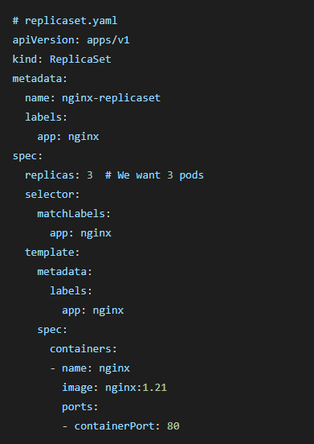
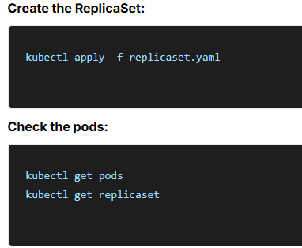
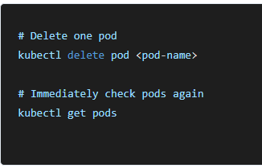
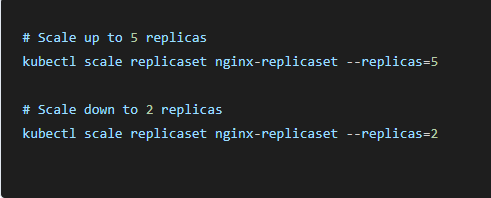
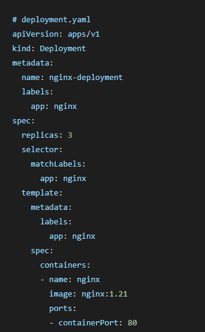
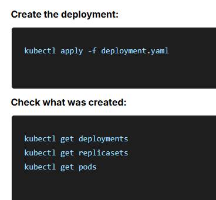

## What is Kubernetes?
Kubernetes (K8s) is like a smart manager for your containers. While Docker runs containers on a single machine, Kubernetes manages containers across multiple machines, making sure they stay healthy, can handle traffic, and automatically recover from failures.Think of it as an orchestra conductor that coordinates all the musicians (containers) to create beautiful music (your application).
### Understanding Kubernetes Objects
Kubernetes objects are like blueprints or instructions that tell Kubernetes what you want your application to look like. 
Each object has a specific job:
- Pod: The smallest unit that runs your container
- ReplicaSet: Ensures you have the right number of pods running
- Deployment: Manages ReplicaSets and handles updates
- Service: Provides a stable way to access your pods
  ## Pod-
  A Pod is the smallest and simplest unit in Kubernetes. It's like a wrapper around one or more containers that need to work closely together.
  **Key concepts:**
  - Usually contains just one container
  - Containers in a pod share the same network and storage
  - Pods are temporary - they come and go
  - Each pod gets its own IP address
  - If a pod dies, it's gone forever (not restarted)

    Creating a pod:
    **kubectl apply -f pod.yaml**

  ## Pod Lifecycle
  Pods go through different phases:
  - Pending: Pod is created but containers aren't running yet
  - Running: Pod is running on a node and at least one container is active
  - Succeeded: All containers completed successfully
  - Failed: At least one container failed
  - Unknown: Pod status couldn't be determined

  **Pods are not permanent: If a pod crashes, it's gone. You need something to restart it. No load balancing: A single pod can't handle lots of traffic. No rolling updates: You can't easily update a pod without downtime.This is where ReplicaSets and Deployments come in.**
  ## Replica Set
    A ReplicaSet is like a guardian that watches over your pods. Its job is to make sure you always have the exact number of pods you want running.
  What it does:
  - Monitors your pods constantly
  - If a pod dies, it creates a new one
  - If there are too many pods, it removes extras
  - If there are too few pods, it creates more
   ### Creating replica set
   
  
   
  
   
  
   
## Deployment
A Deployment is like a smart manager that handles ReplicaSets for you. It's the most commonly used object in Kubernetes because it solves the update problem.
**What it does:**
- Creates and manages ReplicaSets
- Handles rolling updates with zero downtime
- Can rollback to previous versions
- Provides update history
  ### Creating a deployment
  
  
  

# Services: Making Pods Accessible
The Problem with Pod IPsPods have IP addresses, but there's a problem:
- Pod IPs change when pods are recreated
- You have multiple pods behind a deployment
- You need a single, stable way to access your application
## What is a Service?
A Service is like a permanent address for your pods. It provides:- 
- A stable IP address that doesn't change
- Load balancing across multiple pods
- Service discovery (other apps can find your service by name)
- Different ways to expose your application
### Types of services

