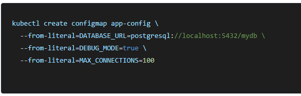
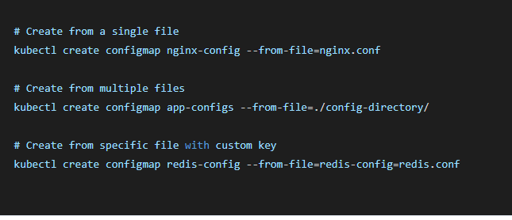
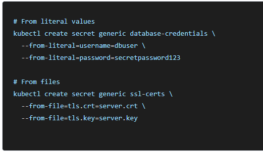
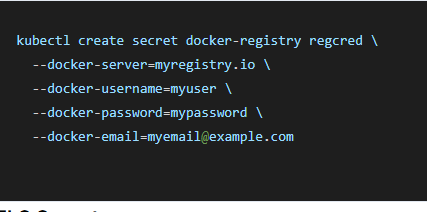
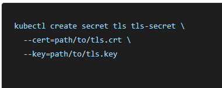

# ConfigMaps
ConfigMaps store non-sensitive configuration data as key-value pairs. They decouple configuration from your container images, making applications portable across environments.

## Creating configmaps
- from literal values

  

- from configuration file

  

- using yaml manifest
```
apiVersion: v1
kind: ConfigMap
metadata:
  name: webapp-config
  namespace: production
data:
  # Simple key-value pairs
  database.host: "postgres.example.com"
  database.port: "5432"
  app.environment: "production"
  
  # Multi-line configuration files
  app.properties: |
    server.port=8080
    management.endpoint.health.show-details=always
    logging.level.com.myapp=DEBUG
    
  nginx.conf: |
    server {
        listen 80;
        server_name example.com;
        
        location / {
            proxy_pass http://backend:8080;
            proxy_set_header Host $host;
        }
    }
```
# Secrets
Secrets are similar to ConfigMaps but specifically designed for sensitive information like passwords, tokens, and certificates. 
They're base64 encoded and can be encrypted at rest.

## Types of secrets

- generic secrets

  
  
- docker registry secrets

  
  
- tls secrets

  

## Creating secrets with YAML


